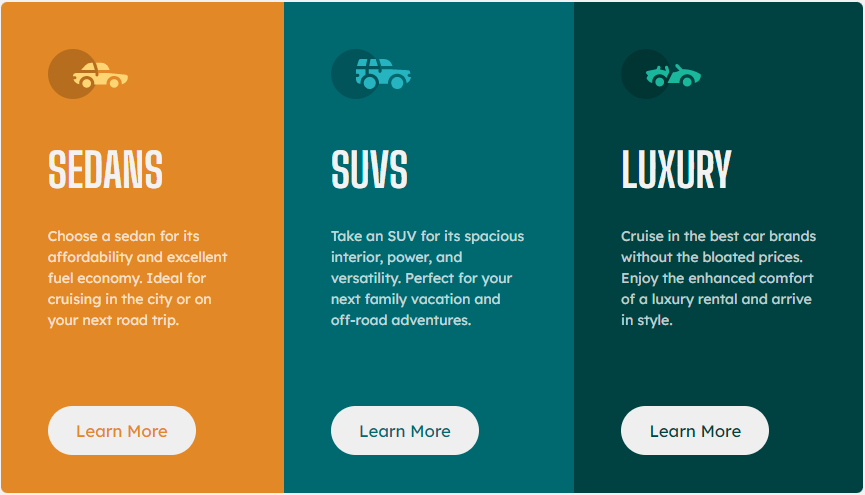

# Frontend Mentor - 3-column preview card component solution

This is a solution to the [3-column preview card component challenge on Frontend Mentor](https://www.frontendmentor.io/challenges/3column-preview-card-component-pH92eAR2-). Frontend Mentor challenges help you improve your coding skills by building realistic projects.

## Table of contents

- [Overview](#overview)
  - [The challenge](#the-challenge)
  - [Screenshot](#screenshot)
  - [Links](#links)
- [My process](#my-process)
  - [Built with](#built-with)
  - [What I learned](#what-i-learned)
  - [Continued development](#continued-development)
  - [Useful resources](#useful-resources)
- [Author](#author)
- [Acknowledgments](#acknowledgments)

**Note: Delete this note and update the table of contents based on what sections you keep.**

## Overview

### The challenge

Users should be able to:

- View the optimal layout depending on their device's screen size
- Work with media query to create a responsive layout
- Work with different css styling

### Screenshot




### Links

- Solution URL: [Add solution URL here](https://your-solution-url.com)
- Live Site URL: [Add live site URL here](https://your-live-site-url.com)

## My process

- Began with mobile layout and transition into desktop layout
- Create a container and centerize the whole container
- Create multiple divs for each car content and some html which represents inner content
- Style the html

### Built with

- Semantic HTML5 markup
- CSS custom properties
- Flexbox
- CSS Grid
- Mobile-first workflow

### What I learned

Somethings I learn are that I need to redo some of these design and responsive layout changes depending on the zoom value of the window.

```css
media query section is something I believe was the key strength in this project
```

### Continued development

- NaN

### Useful resources

- NaN

## Author

- Frontend Mentor - [@khant](https://www.frontendmentor.io/profile/khantmhtoo)

## Acknowledgments

- NaN
