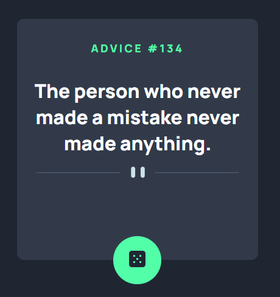
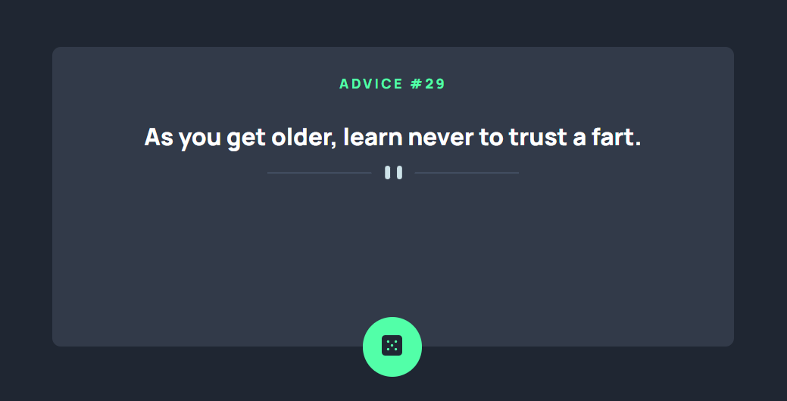

# Frontend Mentor - Advice generator app solution

This is a solution to the [Advice generator app challenge on Frontend Mentor](https://www.frontendmentor.io/challenges/advice-generator-app-QdUG-13db). Frontend Mentor challenges help you improve your coding skills by building realistic projects.

## Table of contents

- [Overview](#overview)
  - [The challenge](#the-challenge)
  - [Screenshot](#screenshot)
  - [Links](#links)
- [My process](#my-process)
  - [Built with](#built-with)
  - [What I learned](#what-i-learned)
  - [Continued development](#continued-development)
  - [Useful resources](#useful-resources)
- [Author](#author)
- [Acknowledgments](#acknowledgments)

**Note: Delete this note and update the table of contents based on what sections you keep.**

## Overview

### The challenge

Users should be able to:

- View the optimal layout for the app depending on their device's screen size
- See hover states for all interactive elements on the page
- Generate a new piece of advice by clicking the dice icon

### Screenshot




### Links

- Solution URL: [Add solution URL here](https://your-solution-url.com)
- Live Site URL: [Add live site URL here](https://your-live-site-url.com)

## My process

- Began with building the initial layout without any JS.
- After getting a similar design, began to work on the JS by first breaking down what parts needed to be changed: advice #, advice content and a button that will change
- From there connect to JS using fetch API to the advice API
- Afterwards the rest is DOM manipulation

### Built with

- Semantic HTML5 markup
- Flexbox
- Mobile-first workflow
- Fetch API
- Advice API (https://api.adviceslip.com)

### What I learned

I learn how to use Fetch API more. How retrieving data works and how to use them in the JS.

```js
function displayAdvice(advice, id) {
  adviceNumber.textContent = id;
  adviceDisplay.textContent = advice;
}

function connectAPI(url) {
  fetch(url)
    .then((response) => response.json())
    .then((data) => displayAdvice(data.slip.advice, data.slip.id));
}

connectAPI("https://api.adviceslip.com/advice");

const changeAdvice = adviceChangeBtn.addEventListener("click", () => {
  connectAPI("https://api.adviceslip.com/advice");
});
```

### Continued development

- For improvements, might be adding a search and making the UI more appealing.

### Useful resources

- NaN

## Author

- Frontend Mentor - [@khant](https://www.frontendmentor.io/profile/khantmhtoo)

## Acknowledgments

- NaN
