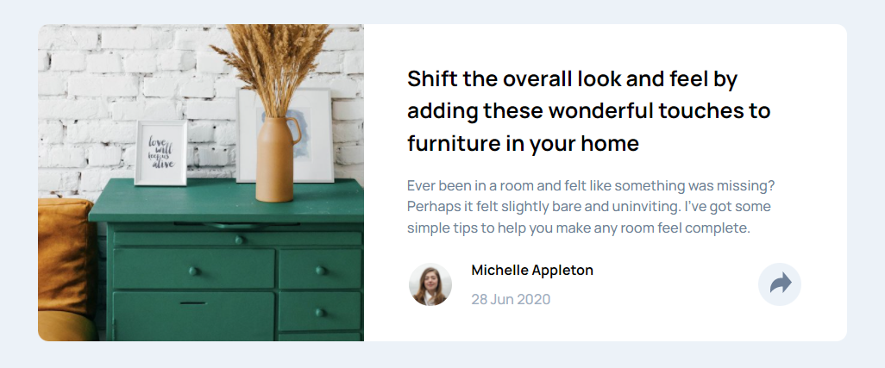
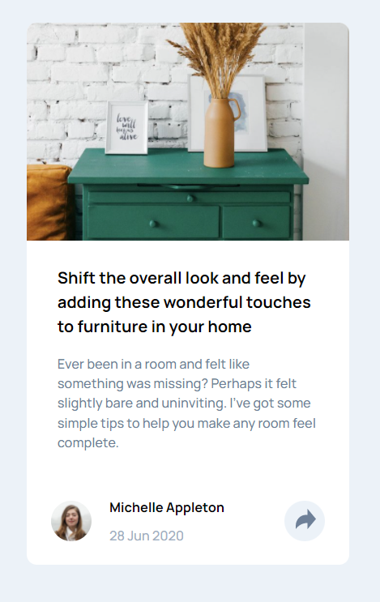
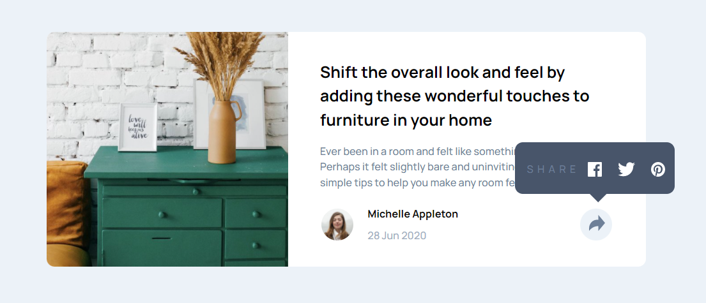
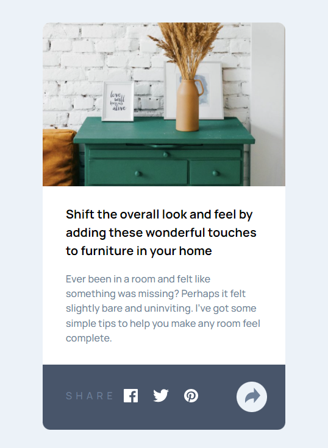

# Frontend Mentor - Article preview component solution

This is a solution to the [Article preview component challenge on Frontend Mentor](https://www.frontendmentor.io/challenges/article-preview-component-dYBN_pYFT). Frontend Mentor challenges help you improve your coding skills by building realistic projects.

## Table of contents

- [Overview](#overview)
  - [The challenge](#the-challenge)
  - [Screenshot](#screenshot)
  - [Links](#links)
- [My process](#my-process)
  - [Built with](#built-with)
  - [What I learned](#what-i-learned)
  - [Continued development](#continued-development)
  - [Useful resources](#useful-resources)
- [Author](#author)
- [Acknowledgments](#acknowledgments)

**Note: Delete this note and update the table of contents based on what sections you keep.**

## Overview

### The challenge

Users should be able to:

- View the optimal layout for the component depending on their device's screen size
- See the social media share links when they click the share icon

### Screenshot






### Links

- Solution URL: [Add solution URL here](https://your-solution-url.com)
- Live Site URL: [Add live site URL here](https://your-live-site-url.com)

## My process

### Built with

- Semantic HTML5 markup
- CSS custom properties
- Flexbox
- Position
- Mobile-first workflow
- Vanilla JS

### What I learned

More interactive transitionings of the mobile to desktop. More experience working with position: especially absolute and relative. Hacky ways to accomplish certain features. Worked and gain some experiences using z-index.

```css
.share-container {
  height: 8.6rem;
  display: flex;
  align-items: center;
  background: var(--clr-vgblue);
  width: 31.8rem;
  position: absolute;
  left: 0;
  z-index: -1;
  border-radius: 0 0 var(--br-100) var(--br-100);
}
.btn {
  z-index: 999;
  position: relative;
  padding: 0 1rem;
  width: 4rem;
  height: 4rem;
  border: none;
  border-radius: 50%;
  background-color: hsl(210, 46%, 95%);
  border: 1px solid transparent;
  transition: 0.25s all ease-in-out;
}
```

```js
const btn = document.querySelector(".btn");
const share = document.querySelector(".share-container");
const arrow = document.querySelector(".arrow-down");
let state = false;
btn.addEventListener("click", () => {
  if (!state) {
    share.style.zIndex = -1;
    arrow.style.background = "transparent";
    state = true;
  } else {
    state = false;
    arrow.style.background = "var(--clr-vgblue)";
    share.style.zIndex = 100;
  }
});
```

### Continued development

-

### Useful resources

-

## Author

- Frontend Mentor - [@khantmhtoo](https://www.frontendmentor.io/profile/khantmhtoo)

## Acknowledgments

-
