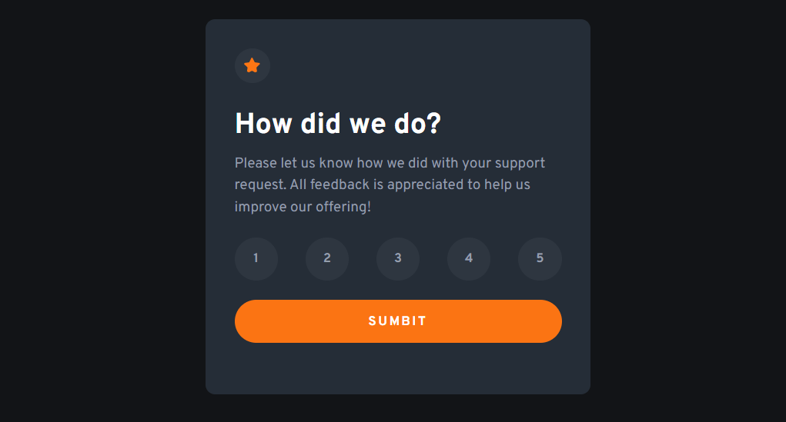
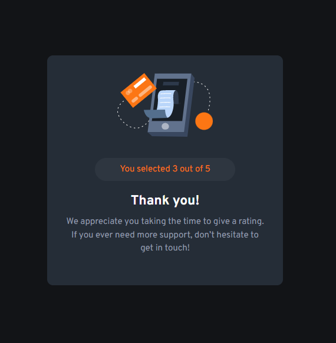

# Frontend Mentor - Interactive rating component solution

This is a solution to the [Interactive rating component challenge on Frontend Mentor](https://www.frontendmentor.io/challenges/interactive-rating-component-koxpeBUmI). Frontend Mentor challenges help you improve your coding skills by building realistic projects.

## Table of contents

- [Overview](#overview)
  - [The challenge](#the-challenge)
  - [Screenshot](#screenshot)
  - [Links](#links)
- [My process](#my-process)
  - [Built with](#built-with)
  - [What I learned](#what-i-learned)
  - [Continued development](#continued-development)
  - [Useful resources](#useful-resources)
- [Author](#author)
- [Acknowledgments](#acknowledgments)

**Note: Delete this note and update the table of contents based on what sections you keep.**

## Overview

### The challenge

Users should be able to:

- View the optimal layout for the app depending on their device's screen size
- See hover states for all interactive elements on the page
- Select and submit a number rating
- See the "Thank you" card state after submitting a rating

### Screenshot




### Links

-

## My process

- Mobile first with HTML and CSS. Built the initial state with JS implemented then moved on to the final state (Thank you part)

### Built with

- Semantic HTML5 markup
- CSS custom properties
- Flexbox
- Mobile-first workflow
- JS

### What I learned

Rather I gain more experience using the DOM Selectors. Other techniques to achieve certain thing.

```js
ratingBtn.forEach((btn) => {
  btn.addEventListener("click", (e) => {
    for (let i of ratingBtn) {
      if (i.classList.contains("active")) {
        i.classList.remove("active");
      }
      btn.classList.add("active");
      selected = true;
    }
  });
});
submitBtn.addEventListener("click", (e) => {
  for (let i of ratingBtn) {
    if (i.classList.contains("active")) {
      ratingData = i.getAttribute("data-value");
    }
  }
  if (!selected) {
    console.log("Has not selected yet");
  } else {
    const outPut = `
    <div class="centering">
        
        <div class="answer">
            <span class="results">You selected ${ratingData} out of 5</span>
        </div>
        <div class="appreciation">
            <h2 class="regards">Thank you!</h2>
            <p class="regards-context">
                We appreciate you taking the time to give a rating. If you ever
                need more support, don’t hesitate to get in touch!
            </p>
        </div>
    </div>`;
    dataReceived.push(ratingData);
    contextContainer.innerHTML = outPut;
  }
});
```

### Continued development

- For future add-ons one things that could be cool to improve for this project would the data transaction between two sides. Just simple data GET and POST would be cool.

### Useful resources

-

## Author

- Frontend Mentor - [@khantmhtoo](https://www.frontendmentor.io/profile/khantmhtoo)

## Acknowledgments

-
