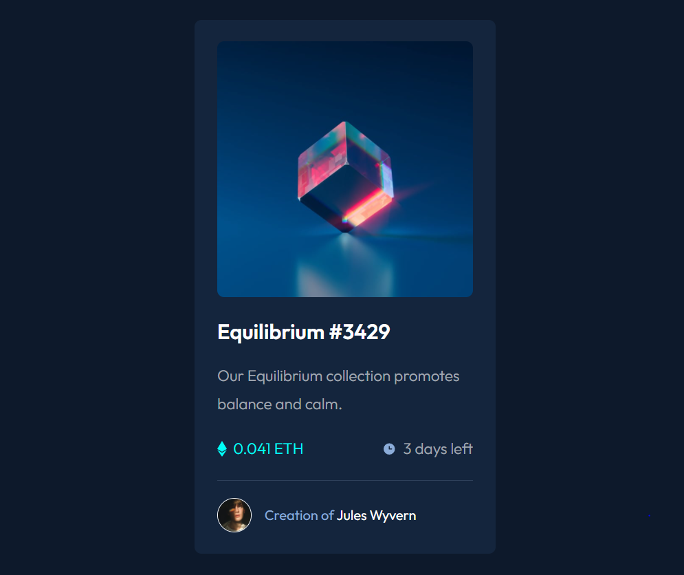

# Frontend Mentor - NFT preview card component solution

This is a solution to the [NFT preview card component challenge on Frontend Mentor](https://www.frontendmentor.io/challenges/nft-preview-card-component-SbdUL_w0U). Frontend Mentor challenges help you improve your coding skills by building realistic projects.

## Table of contents

- [Overview](#overview)
  - [The challenge](#the-challenge)
  - [Screenshot](#screenshot)
  - [Links](#links)
- [My process](#my-process)
  - [Built with](#built-with)
  - [What I learned](#what-i-learned)
  - [Continued development](#continued-development)
  - [Useful resources](#useful-resources)
- [Author](#author)
- [Acknowledgments](#acknowledgments)

**Note: Delete this note and update the table of contents based on what sections you keep.**

## Overview

### The challenge

Users should be able to:

- View the optimal layout depending on their device's screen size
- See hover states for interactive elements

### Screenshot



### Links

- Solution URL: [Add solution URL here](https://your-solution-url.com)
- Live Site URL: [Add live site URL here](https://your-live-site-url.com)

## My process

### Built with

- Semantic HTML5 markup
- CSS custom properties
- Flexbox
- CSS Position/Transform
- CSS Opacity
- CSS Grid
- Mobile-first workflow

### What I learned

Things I've learn from this project is the overlay of the nft card. It is one of the best written code by me so far with more thinking taught behind it and my previous knowledge was applied ("Flex"). From there everything was somewhat test-and-trail.

```css
.content-img-middle {
  position: absolute;
  display: flex;
  justify-content: center;
  align-items: center;
  width: 297.5px;
  height: 297.5px;
  background-color: var(--clr-cyan);
  border-radius: var(--br-100);
  transform: translateY(-101%);
  opacity: 0;
}
.content-title {
  margin: 2rem 0;
  font-size: var(--fs-300);
  transition: 0.25s ease-in-out all;
}
.content-wrap:hover .content-title {
  color: var(--clr-cyan);
  cursor: pointer;
}
.content-wrap:hover .content-img-middle {
  opacity: 1;
  background-color: hsl(178, 100%, 50%, 0.5);
}
```

### Continued development

- One way to continued this project is to create multiple more card and instead of the creator's name being imply at the end. There could API linking to the statistics, trends, and exchange rates (more).
- Another continued development that I might do later as I process in my learn would be implementing a side scroll to different cards.

### Useful resources

- W3school for overlay

## Author

- Frontend Mentor - [@khant](https://www.frontendmentor.io/profile/khantmhtoo)

## Acknowledgments

- NaN
